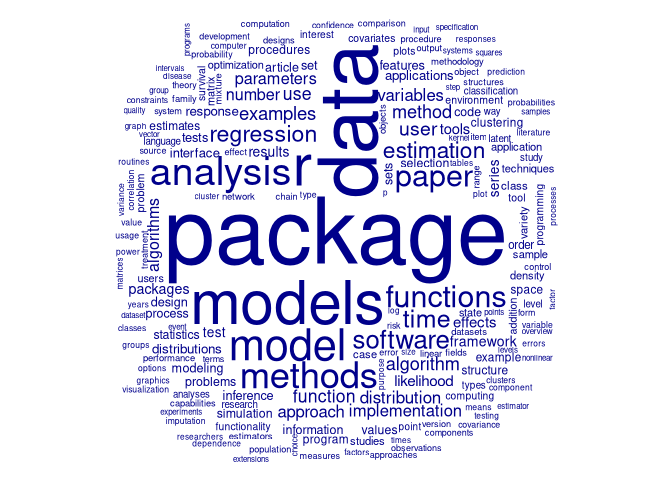
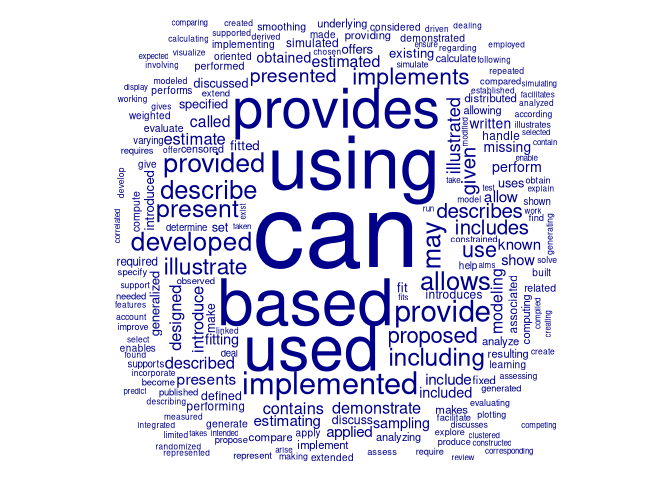

## Scrape the Abstracts

This code gets the number of papers for each volume:

``` r
library (magrittr)
num_papers <- function (volume = 13) {
    u <- paste0 ("https://www.jstatsoft.org/issue/view/v",
                 sprintf ("%03d", volume))
    x <- xml2::read_html (u)

    # content is sometimes only Articles, but other times Articles, Reviews,
    # Technical Notes, and other categories. Each of this is delineated by
    # a simple div:tocSectionTitle, so these need to be identified, and content
    # parsed only for "Articles".
    content <- rvest::html_nodes (x, "#content") %>%
        rvest::html_children ()
    index <- grep ("tocSectionTitle", rvest::html_attrs (content))
    divs <- rvest::html_text (content [index])
    articles <- grep ("Articles", divs)
    if (articles == 1 & length (index) > 1) {
        content <- content [(index [1] + 1):(index [2] - 1)]
    } else if (articles == length (divs)) {
        content <- content [(index [articles] + 1):length (content)]
    } else {
        content <- content [(index [articles] + 1):(index [articles + 1] - 1)]
    }
    content <- content [grep ("tocArticle", content)]

    #td <- rvest::html_nodes (x, "td") %>%
    #    rvest::html_attrs () %>%
    #    unlist () %>%
    #    unname ()
    #length (which (td == "tocTitle"))
    return (length (content))
}
volume <- 1
npapers <- num_papers (volume)
message ("Volume ", volume, " has ", npapers, " papers")
#> Volume 1 has 4 papers
```

This extracts the title and abstract for one paper:

``` r
get_abstract <- function (volume = 13, paper = 1) {
    u <- paste0 ("https://www.jstatsoft.org/index.php/jss/article/view/v",
                 sprintf ("%03d", volume), "i", sprintf ("%02d", paper))
    x <- xml2::read_html (u)
    # The 2 fields are embedded in meta:
    title <- rvest::html_nodes (x, "meta[name='description']") %>%
        rvest::html_attr ("content")
    abstract <- rvest::html_nodes (x, "meta[name='DC.Description']") %>%
        rvest::html_attr ("content")
    date <- rvest::html_nodes (x, "meta[name='DC.Date.issued']") %>%
        rvest::html_attr ("content")

    # alternative: Extract from body - some volumes/papers don't have the meta:
    if (nchar (abstract) == 0 | nchar (title) == 0) {
        txt <- rvest::html_nodes (x, "td") %>%
            rvest::html_text ()
        title <- txt [grep ("^Title:", txt) + 1]
        abstract <- txt [grep ("^Abstract:", txt) + 1]
    }

    # Volume 76 has final 2 articles with non-standard URLs which fail here
    ret <- NULL
    if (length (abstract) > 0 | length (title) > 0) {
        ret <- list (title = title,
                     abstract = abstract,
                     date = date)
    }
    return (ret)
}
get_abstract (1, 3)
#> $title
#> [1] "XLISP-Stat Tools for Building Generalised Estimating Equation Models"
#> 
#> $abstract
#> [1] "This paper describes a set of Lisp-Stat tools for building Generalised Estimating Equation models to analyse longitudinal or clustered measurements. The user interface is based on the built-in regression and generalised linear model prototypes, with the addition of object-based error functions, correlation structures and model formula tools. Residual and deletion diagnostic plots are available on the cluster and observation level and use the dynamic graphics capabilities of Lisp-Stat."
#> 
#> $date
#> [1] "1996-08-16"
```

Get the current—and therefore maximal—volume number:

``` r
current_vol <- function () {
    u <- "https://www.jstatsoft.org/issue/archive"
    x <- xml2::read_html (u)
    n <- rvest::html_nodes (x, "div[id='issues']") %>%
        rvest::html_nodes ("div[id]") %>%
        rvest::html_attrs () %>%
        unlist () %>%
        unname ()
    as.integer (gsub ("issue-", "", n [grep ("issue-", n)]) [1])
}
current_vol ()
#> [1] 91
```

Get all abstracts:

``` r
get_all_abstracts <- function () {
    vmax <- current_vol ()
    res <- tibble::tibble (date = character (),
                           volume = integer (),
                           number = integer (),
                           title = character (),
                           abstract = character ())

    pb <- utils::txtProgressBar (style = 3)
    for (i in seq (vmax)) {
        n <- num_papers (i)
        for (j in seq (n)) {
            a <- get_abstract (i, j)
            if (!is.null (a)) {
                res <- rbind (res, tibble::tibble (date = a$date,
                                                   volume = i,
                                                   number = j,
                                                   title = a$title,
                                                   abstract = a$abstract))
            }
        }
        utils::setTxtProgressBar (pb, i / vmax)
    }
    close (pb)

    return (res)
}
if (!file.exists ("jss-abstracts.Rds")) {
    a <- get_all_abstracts ()
    saveRDS (a, file = "jss-abstracts.Rds")
}
```

## Analyses

These presume all of the above to have been run, and a local
`"jss-abstracts.Rds"` file to have been created.

``` r
library (magrittr)
library (quanteda)
library (topicmodels)
a <- readRDS ("jss-abstracts.Rds")
q <- corpus (a$abstract)
docvars (q, "year") <- as.integer (substring (a$date, 1, 4))
docvars (q, "volume") <- as.integer (a$volume)
docvars (q, "number") <- as.integer (a$number)

d <- dfm (q, remove = quanteda::stopwords (), remove_punct = TRUE)
```

topic models don’t reveal anything:

``` r
#quanteda::textplot_wordcloud (d)
d <- dfm_trim (d, min_termfreq = 10)
my_lda <- LDA (d, k = 5)
knitr::kable (get_terms (my_lda, 20))
```

| Topic 1    | Topic 2      | Topic 3     | Topic 4        | Topic 5    |
| :--------- | :----------- | :---------- | :------------- | :--------- |
| can        | package      | package     | r              | data       |
| r          | models       | data        | model          | package    |
| package    | r            | models      | using          | methods    |
| data       | model        | analysis    | data           | model      |
| models     | can          | can         | methods        | using      |
| functions  | also         | statistical | statistical    | r          |
| time       | analysis     | provides    | available      | use        |
| provides   | paper        | use         | also           | regression |
| paper      | statistical  | software    | used           | used       |
| linear     | used         | used        | regression     | examples   |
| estimation | using        | r           | different      | models     |
| software   | available    | algorithms  | new            | several    |
| different  | data         | methods     | estimation     | provides   |
| method     | framework    | modeling    | test           | software   |
| using      | algorithm    | set         | method         | paper      |
| based      | distribution | clustering  | implementation | two        |
| variables  | use          | also        | algorithm      | user       |
| analysis   | based        | user        | approach       | functions  |
| large      | estimation   | provide     | effects        | based      |
| number     | examples     | well        | linear         | number     |

spacy-parsed nouns and verbs also don’t reveal anything:

``` r
library (spacyr)
spacy_initialize ()

# extract lists of nouns and verbs:
nv <- pbapply::pblapply (a$abstract, function (i) {
    s <- spacy_parse (i)
    list (noun = s$token [grep ("NOUN", s$pos)],
          verb = s$token [grep ("VERB", s$pos)])
                           })
nouns <- unlist (lapply (nv, function (i) paste0 (i$noun, collapse = " ")))
verbs <- unlist (lapply (nv, function (i) paste0 (i$verb, collapse = " ")))
dn <- dfm (nouns, remove = stopwords (), remove_punct = TRUE)
dv <- dfm (verbs, remove = stopwords (), remove_punct = TRUE)
```

### Word cloud of all nouns

``` r
textplot_wordcloud (dn, max_words = 200, max_size = 8)
```



### Word cloud of all verbs

``` r
textplot_wordcloud (dv, max_words = 200, max_size = 9)
```



### Topic Models of Nouns and Verbs

``` r
lda_n <- LDA (dn, k = 5)
knitr::kable (get_terms (lda_n, 10))
```

| Topic 1      | Topic 2    | Topic 3    | Topic 4   | Topic 5      |
| :----------- | :--------- | :--------- | :-------- | :----------- |
| r            | data       | models     | package   | package      |
| package      | package    | model      | data      | data         |
| methods      | r          | package    | analysis  | r            |
| software     | methods    | data       | r         | distribution |
| algorithms   | analysis   | regression | time      | test         |
| code         | clustering | estimation | series    | tests        |
| paper        | algorithm  | r          | models    | paper        |
| data         | functions  | likelihood | functions | sample       |
| optimization | density    | functions  | paper     | algorithm    |
| computing    | method     | parameters | methods   | number       |

``` r
lda_v <- LDA (dv, k = 5)
knitr::kable (get_terms (lda_v, 10))
```

| Topic 1     | Topic 2    | Topic 3     | Topic 4    | Topic 5   |
| :---------- | :--------- | :---------- | :--------- | :-------- |
| based       | used       | can         | describe   | using     |
| can         | provides   | using       | can        | can       |
| used        | can        | implemented | using      | based     |
| implemented | based      | allows      | presented  | provides  |
| developed   | provided   | provide     | used       | obtained  |
| provides    | allows     | given       | based      | proposed  |
| using       | may        | based       | provided   | used      |
| present     | implements | present     | including  | given     |
| provided    | provide    | describes   | implements | called    |
| provide     | using      | generalized | estimated  | described |

… none of those reveal anything useful.

## changes over time

First collate the abstract on annual bases:

``` r
a <- readRDS ("jss-abstracts.Rds")
library (stringr)
# The vectorized version of stringr::str_replace_all is nearly 10 times faster
# than gsub on stops <- paste0 (stops, collapse = "|"). Note that it needs the
# vector of patterns to be named.
collate_abstracts <- function (a) {
    a$year <- as.integer (substring (a$date, 1, 4))
    years <- sort (unique (a$year))
    abstracts <- rep (NA, length (years))
    #stops <- paste0 (paste0 ("\\s", quanteda::stopwords (), "\\s"), collapse = "|")
    stops <- paste0 ("\\s", quanteda::stopwords (), "\\s")
    repl <- rep ("", length (stops))
    names (stops) <- names (repl) <- paste0 (seq_along (stops)) # necessary!
    for (y in seq (years)) {
        ab <- paste0 (a$abstract [a$year == years [y]], collapse = " ")
        #ab <- gsub (stops, " ", ab)
        #ab <- gsub ("[[:punct:]]", "", ab)
        ab <- str_replace_all (ab, stops, repl)
        ab <- str_replace_all (ab, "[[:punct:]]", "")
        abstracts [y] <- ab
    }
    names (abstracts) <- years
    return (abstracts)
}
abstracts <- collate_abstracts (a)
```

Then convert to word-frequency tables and correlate inter-annual
frequencies between word frequencies (for all words with freq \> 1).

``` r
library (ggplot2)
abstract_freqs <- lapply (abstracts, function (i) {
            res <- table (paste0 (tolower (tokens (i))))
            freqs <- as.integer (res)
            names (freqs) <- names (res)
            res <- stats::aggregate (freqs, by = list (names (freqs)), FUN = sum)
            names (res) <- c ("token", "n")
            return (res)
            })
a1 <- abstract_freqs [-length (abstract_freqs)]
a2 <- abstract_freqs [-1]
r2 <- rep (NA, length (a1))
for (i in seq_along (a1)) {
    a1i <- a1 [[i]] [a1 [[i]]$n > 1, ]
    a2i <- a2 [[i]] [a2 [[i]]$n > 1, ]
    a <- dplyr::inner_join (a1i, a2i, by = "token")
    r2 [i] <- cor (a [, 2], a [, 3])
}
dat <- data.frame (year = as.integer (names (a2)),
                   r2 = r2 ^ 2)
ggplot (dat, aes (x = year, y = r2)) +
    geom_point (col = "#D24373", cex = 2) +
    geom_line (col = "#FF4373") +
    ylab ("Similarity in abstract texts to previous year") +
    theme (axis.title.y = element_text (angle = 90))
```


And that finally reveals one useful insights: The abstracts have over
time become very notably *more* similar, and converted towards a very
pronounced uniformity (R<sup>2</sup> \> 0.98).

## Unique Words

The uniformity, and the generic nature of the wordclouds and topic
models, may indicate that differences between abstracts actually arise
in their focal nouns or verbs, and that these are actually used very
infrequently. The following analysis extracts the unique words from each
abstract.

``` r
library (quanteda)
library (spacyr)
spacy_initialize ()
#> spaCy is already initialized
#> NULL
a <- readRDS ("jss-abstracts.Rds")
toks <- paste0 (a$abstract, collapse = " ") %>%
    tolower () %>%
    tokens () %>%
    paste0 ()
toks <- toks [!toks %in% stopwords () & nchar (toks) > 2]
# remove a few non-words
toks <- toks [!grepl ("^www|[1-9]", toks)]
temp <- table (toks)
tok_n <- as.integer (temp)
names (tok_n) <- names (temp)
toks1 <- spacy_parse (names (tok_n [tok_n == 1]))
verbs <- toks1$token [grep ("VERB", toks1$pos)]
nouns <- toks1$token [grep ("NOUN", toks1$pos)]
```

Then take the nouns and construct a network by measuring textual
positions between each. Note that `spacy_parse` parses some uniquely
identified tokens into multiple spacy-equivalent tokens, and so not all
of these are necessarily unique. This code generates a distance matrix
of the minimal textual distance between each pair of unique words within
the entire corpus of abstracts.

``` r
library (stringr)
nouns <- nouns [nchar (nouns) > 1]
res <- str_locate_all (paste0 (toks, collapse = " "), pattern = nouns)
for (i in seq_along (res)) res [[i]] <- cbind (res [[i]], i)
res <- data.frame (do.call (rbind, res) [, c (1, 3)])
res$noun <- nouns [res$i]
```

That then gives a `data.frame` with 3 columns of (1) start position of
each of the 2747 nouns; an index `i` enumerating the nouns, and the
nouns themselves.

``` r
abstracts <- corpus (a$abstract) %>%
    tokens (remove_punct = TRUE) %>%
    tokens_tolower () %>%
    tokens_remove (pattern = stopwords ("English"))
# make dictionary of nouns
nouns <- unique (nouns)
dict <- as.list (nouns)
names (dict) <- nouns
dict <- dictionary (dict)
fcmat <- fcm (abstracts)
fcmat <- fcm_select (fcmat, pattern = dict)
rs <- rowSums (fcmat)
lens <- vapply (0:10, function (i) length (which (rs > i)), integer (1))
rsi <- (0:10) [which (lens < 1000) [1]]
index <- which (rs > rsi)
fcmat <- fcmat [index, index]
#textplot_network (fcmat, min_freq = 0.9)
```

The `textplot_network` function is unintelligible because it’s static
and illegibly complex. Need to convert it to a dynamic representation,
which the following code does through constructing a `.js`
representation suitable for visualization via `visjs`. (Note that other
options including the `networkD3` and `sigmajs` packages are not at all
responsive for networks of this size.)

``` r
# convert the matrix to non-zero edges:
m <- as.matrix (fcmat)
m <- m + t (m) # render to symmetric matrix:
m [lower.tri (m)] <- 0 # reduce to upper tri only
diag (m) <- 0
res <- rep (list (NULL), nrow (m))
names (res) <- rownames (m)
for (i in seq (nrow (m))) {
    index <- which (m [i, ] > 0)
    res [[i]] <- m [i, index, drop = FALSE]
}
res <- res [which (lapply (res, length) > 0)]
from <- lapply (res, function (i) rep (rownames (i), ncol (i))) %>%
    unlist () %>%
    unname ()
to <- lapply (res, function (i) colnames (i)) %>%
    unlist () %>%
    unname ()
res <- data.frame (from = from,
                   to = to,
                   fromi = match (from, rownames (fcmat)),
                   toi = match (to, rownames (fcmat)),
                   n = unname (unlist (res)),
                   stringsAsFactors = FALSE)
# reduce to edges above defined weight limit:
wlim <- 100
res <- res [res$n > wlim, ]

# output the remaining nodes
nodes <- rbind (data.frame (node = res$from,
                            i = res$fromi,
                            stringsAsFactors = FALSE),
                data.frame (node = res$to,
                            i = res$toi,
                            stringsAsFactors = FALSE))
nodes <- nodes [which (!duplicated (nodes)), ]
# add results from clustering analysis below, to assign nodes to groups
nodes$group <- 0
#for (i in seq (cl)) {
#    nodes$group [which (nodes$node %in% cl [[i]])] <- i
#}
out <- "var nodes = new vis.DataSet(["
for (i in seq (nrow (nodes)))
    out <- c (out, paste0 ("    { id: ", nodes$i [i], ",",
                           "group: ", nodes$group [i], ",",
                           "label: \"", nodes$node [i], "\" },"))

out <- c (out, "]);", "", "", "var edges = new vis.DataSet([")
res_str <- apply (res, 1, function (i)
                  paste0 ("    { from: ", i [3],
                           ", to: ", i [4],
                           #", arrows: \"to\"",
                           ", value: ", i [5], " },"))
out <- c (out, res_str, "]);")

out <- c (out, "", "",
          "var container = document.getElementById(\"mynetwork\");",
          "var data = {",
          "    nodes: nodes,",
          "    edges: edges",
          "};",
          "var options = {",
          "    nodes: {",
          "        shape: \"box\",",
          "        margin: 10,",
          "        widthConstraint: {",
          "            maximum: 200",
          "        },",
          "        shadow: true",
          "    },",
          "    edges: {",
          "        shadow: true,",
          "        smooth: true",
          "    },",
          "    physics: {",
          "        barnesHut: { gravitationalConstant: -20000 },",
          "        stabilization: { iterations: 2500 }",
          "    }",
          "};",
          "",
          "",
          "var network = new vis.Network(container, data, options);")
```

dump that to a file

``` r
con <- file ("./network.js", "w")
writeLines (out, con = con)
close (con)
```

That works, at least with the high threshold of `wlim = 100`, but the
initial rendering is still quite slow, and so there seems no way to
visualise anything like the full network. That threshold results in 81
nodes and 253 edges. Dropping to `wlim = 50` increases those to 140
nodes and 616 edges. The resultant network does appear after some time,
but is the quite hard to interpret intelligibly at all.

## Network clustering

A “cheaper” way to view relationships within the network might be to
generate simple clusters from the feature co-occurrence matrix. This can
be done by adapting the above code to generate a relationship matrix
between the nodes, and use that to define clusters. The following code
applies `dbscan` iteratively until all clusters have \< 100 members, and
automatically adjusted the `eps` parameter to achieve the greatest
numbers of clusters that are most evenly distributed.

``` r
library (dbscan)
# function to find optimal value of eps, as the value giving the longest
# table with smallest dominant cluster size This can't use `optimise`,
# because the response is not smooth
# @param m A dissimilarity matrix
opteps <- function (m, minPts = 10) {
    clstats <- function (m, eps, minPts) {
        vapply (eps, function (i) {
                       x <- dbscan (m, eps = i, minPts = minPts)
                       tab <- table (x$cluster)
                       if (length (tab) == 1)
                           ret <- -1
                       else
                           ret <- length (tab) / max (tab)
                       return (ret) }, numeric (1))
    }
    eps <- 10 ^ ((-10:-2) / 2)
    val <- clstats (m, eps, minPts = minPts)
    if (all (val < 0))
        return (NULL)

    eps <- eps [which.max (val)] + (-5:5) * eps [which.max (val)] / 5
    eps <- eps [eps > 0]
    val <- clstats (m, eps, minPts = minPts)
    eps [which.max (val)]
}

# Then the meta-function to divide fcmat into clusters between minPts and maxPts
cluster_net <- function (fcmat, minPts = 10, maxPts = 100) {
    m <- as.matrix (fcmat)
    m <- m + t (m) # render to symmetric matrix:
    #m [lower.tri (m)] <- 0 # reduce to upper tri only
    diag (m) <- 0
    m <- 1 - m / max (m) # convert to a measure of distance
    minPts <- 10
    eps <- opteps (m, minPts = minPts)
    x <- dbscan (m, eps = eps, minPts = minPts)
    s <- split (rownames (m), f = as.factor (x$cluster))

    index <- which (vapply (s, length, integer (1)) > 100)
    indivisible <- rep (FALSE, length (s))
    while (length (index) > 0) {
        sadd <- list ()
        indiv_add <- NULL
        for (i in index) {
            si <- s [[i]]
            index2 <- match (si, rownames (m))
            msub <- m [index2, index2]
            eps <- opteps (msub, minPts = minPts)
            if (is.null (eps)) {
                indiv_add <-  c (indiv_add, TRUE)
                sadd <- c (sadd, list (si))
            } else {
                x <- dbscan (msub, eps = eps, minPts = minPts)
                indiv_add <- c (indiv_add, rep (FALSE, length (unique (x$cluster))))
                sadd <- c (sadd, split (rownames (msub), as.factor (x$cluster)))
            }
        }
        s [index] <- NULL
        indivisible <- indivisible [!seq (indivisible) %in% index]
        s <- c (s, sadd)
        indivisible <- c (indivisible, indiv_add)
        index <- which (vapply (s, length, integer (1)) > 100)
        indiv_i <- seq (indivisible) [indivisible]
        index <- index [!index %in% indiv_i]
    }
    names (s) <- NULL

    return (s)
}

cl <- cluster_net (fcmat, minPts = 10, maxPts = 100)
print (cl)
#> [[1]]
#>  [1] "downloads"    "installs"     "plugins"      "helpers"      "communicator"
#>  [6] "lynx"         "configure"    "nothing"      "clients"      "compile"     
#> [11] "ranlib"       "dcdflib"      "solaris"      "httpd"        "fork"        
#> 
#> [[2]]
#>  [1] "palaeoecology" "subfossil"     "lake"          "ocean"        
#>  [5] "bog"           "sediments"     "ecosystems"    "fossil"       
#>  [9] "pollution"     "waters"        "acidification" "diatom"       
#> 
#> [[3]]
#>  [1] "ggenealogy"  "rutter"      "vanderplas"  "cook"        "connections"
#>  [6] "branches"    "diagrams"    "milestone"   "cultivars"   "soybean"    
#> [11] "varieties"   "hymowitz"   
#> 
#> [[4]]
#>  [1] "model"          "data"           "user"           "program"       
#>  [5] "analysis"       "code"           "order"          "models"        
#>  [9] "interface"      "regression"     "linear"         "error"         
#> [13] "cluster"        "use"            "clustering"     "function"      
#> [17] "statistics"     "server"         "number"         "java"          
#> [21] "cgi"            "language"       "process"        "likelihood"    
#> [25] "package"        "tests"          "matrix"         "point"         
#> [29] "estimates"      "effects"        "standard"       "multivariate"  
#> [33] "distributions"  "users"          "c"              "variety"       
#> [37] "survival"       "time"           "distribution"   "study"         
#> [41] "component"      "case"           "software"       "simulation"    
#> [45] "optimal"        "carlo"          "beta"           "system"        
#> [49] "variables"      "density"        "t"              "problem"       
#> [53] "r"              "information"    "specification"  "classification"
#> [57] "test"           "interest"       "framework"      "response"      
#> [61] "dependence"     "uses"           "estimation"     "parameter"     
#> [65] "sas"            "structure"      "theory"         "estimators"    
#> [69] "space"          "risk"           "effect"         "comparison"    
#> [73] "sample"         "markov"         "chain"          "optimization"  
#> [77] "objects"        "range"          "mcmc"           "selection"     
#> [81] "population"     "modeling"       "class"          "state"         
#> [85] "gui"            "treatment"      "imputation"     "item"          
#> [89] "irt"            "stream"        
#> 
#> [[5]]
#>  [1] "quality"       "technique"     "object"        "building"     
#>  [5] "level"         "index"         "source"        "processes"    
#>  [9] "apply"         "s"             "ratio"         "web"          
#> [13] "computer"      "poisson"       "file"          "count"        
#> [17] "purpose"       "disease"       "em"            "vector"       
#> [21] "performs"      "graph"         "points"        "matlab"       
#> [25] "document"      "area"          "y"             "densities"    
#> [29] "gamma"         "k"             "window"        "text"         
#> [33] "dirichlet"     "link"          "factor"        "literature"   
#> [37] "d"             "bayes"         "control"       "interval"     
#> [41] "length"        "simulations"   "estimator"     "procedure"    
#> [45] "groups"        "type"          "platform"      "search"       
#> [49] "wavelet"       "individual"    "dimension"     "reduction"    
#> [53] "plot"          "inverse"       "principal"     "table"        
#> [57] "value"         "decomposition" "species"       "vista"        
#> [61] "association"   "group"         "core"          "stata"        
#> [65] "memory"        "sciences"      "curve"         "covariate"    
#> [69] "accuracy"      "volume"        "learning"      "dose"         
#> [73] "pattern"       "feature"       "threshold"     "anova"        
#> [77] "commander"     "hazard"        "map"           "subjects"     
#> [81] "panel"         "field"         "m"             "subject"      
#> [85] "transition"    "ergm"          "event"         "odds"         
#> 
#> [[6]]
#>  [1] "concentration" "observation"   "hand"          "pages"        
#>  [5] "step"          "failure"       "cause"         "patient"      
#>  [9] "origin"        "laird"         "rubin"         "end"          
#> [13] "variate"       "von"           "alpha"         "sum"          
#> [17] "sigma"         "region"        "loss"          "run"          
#> [21] "gibbs"         "combinations"  "contrast"      "cell"         
#> [25] "counts"        "behavior"      "complexity"    "singular"     
#> [29] "select"        "coefficient"   "making"        "science"      
#> [33] "u"             "format"        "operating"     "priors"       
#> [37] "stage"         "splines"       "phase"         "batch"        
#> [41] "shape"         "tail"          "element"       "decision"     
#> [45] "cost"          "resolution"    "date"          "log"          
#> [49] "rank"          "iterative"     "unit"          "trait"        
#> [53] "haplotype"     "location"      "gradient"      "domain"       
#> [57] "start"         "color"         "grid"          "objective"    
#> [61] "array"         "reduce"        "line"          "life"         
#> [65] "returns"       "skew"          "trajectories"  "variation"    
#> [69] "intervention"  "voxels"        "maximization"  "mm"           
#> [73] "expectation"   "escalation"    "cytometry"     "mst"          
#> [77] "randomization" "pi"            "mother"        "child"        
#> [81] "genotype"     
#> 
#> [[7]]
#>   [1] "ordination"        "migrants"          "valand"           
#>   [4] "pioneering"        "kendall"           "dozens"           
#>   [7] "vetoes"            "activism"          "infections"       
#>  [10] "repor"             "fear"              "vations"          
#>  [13] "dyads"             "disorders"         "lifestyle"        
#>  [16] "susceptibility"    "nucleotide"        "polymorphisms"    
#>  [19] "ignores"           "chromosome"        "cofactors"        
#>  [22] "proteins"          "organism"          "liquid"           
#>  [25] "chromatography"    "compensation"      "amsrpm"           
#>  [28] "bioreactors"       "nmrs"              "substrates"       
#>  [31] "carbon"            "assembles"         "pool"             
#>  [34] "hartigan"          "erdman"            "emerson"          
#>  [37] "segment"           "lymph"             "kohrt"            
#>  [40] "ihaka"             "gentleman"         "videos"           
#>  [43] "dinges"            "train"             "staff"            
#>  [46] "redesign"          "reimplementation"  "enrich"           
#>  [49] "lectures"          "rin"               "respond"          
#>  [52] "stimuli"           "rizopoulos"        "martin"           
#>  [55] "park"              "mirt"              "bock"             
#>  [58] "aitkin"            "visibility"        "obstruction"      
#>  [61] "probabilites"      "sightabilitymodel" "minnesota"        
#>  [64] "rcppeigen"         "eigen"             "guennebaud"       
#>  [67] "jacob"             "eddelbuettel"      "extracat"         
#>  [70] "mosaicplots"       "spineplots"        "ceiling"          
#>  [73] "shadings"          "palettes"          "iwidgets"         
#>  [76] "query"             "openstreetmap"     "pngs"             
#>  [79] "overlay"           "hotspot"           "oscillation"      
#>  [82] "saha"              "johansson"         "teleconnections"  
#>  [85] "eot"               "microsimulation"   "businesses"       
#>  [88] "microdatasets"     "inequalities"      "attainment"       
#>  [91] "ballas"            "birkin"            "celebrates"       
#>  [94] "anniversary"       "festschrift"       "chair"            
#>  [97] "accomplishments"   "guest"             "editors"          
#> [100] "jedidi"            "desarbo"           "asparouhov"       
#> [103] "gottfredson"       "mplus"             "moosbrugger"      
#> [106] "kelava"            "reproduction"      "versionspecific"  
#> [109] "cohorts"           "hosts"             "tarballs"         
#> [112] "retrieval"         "completing"       
#> 
#> [[8]]
#>  [1] "nonstationarity"  "implemenation"    "kaufman"          "asypow"          
#>  [5] "applet"           "calibrate"        "mod"              "likelikhood"     
#>  [9] "nubmer"           "spirit"           "co"               "twoway"          
#> [13] "loading"          "candidates"       "jason"            "cuestion"        
#> [17] "procure"          "alters"           "calcfisher"       "mccullagh"       
#> [21] "travel"           "consumers"        "tau"              "bailer"          
#> [25] "relaimpo"         "mlm"              "bulk"             "manipulations"   
#> [29] "hyper"            "sna"              "mlds"             "coordination"    
#> [33] "dimatteo"         "majorization"     "stretches"        "calc"            
#> [37] "zigams"           "termstrc"         "covariation"      "tract"           
#> [41] "norms"            "geobugs"          "microstructure"   "midi"            
#> [45] "mea"              "kits"             "imbalances"       "character"       
#> [49] "picard"           "adaboost"         "foreach"          "cube"            
#> [53] "calcu"            "likert"           "reformulation"    "impacts"         
#> [57] "fitdistrplus"     "batchexperiments" "registers"        "optimizes"       
#> [61] "covsel"           "jointness"        "slowdown"         "proof"           
#> [65] "supervisor"       "rjags"            "etasflp"          "dendrograms"     
#> [69] "organisation"     "acts"             "mplot"            "mirror"          
#> [73] "saturation"       "convexity"        "geophysics"      
#> 
#> [[9]]
#>  [1] "bounds"      "script"      "pearson"     "deviance"    "goodness"   
#>  [6] "disk"        "generator"   "sub"         "ject"        "row"        
#> [11] "macros"      "term"        "lattice"     "researcher"  "student"    
#> [16] "fourier"     "product"     "mode"        "similarity"  "default"    
#> [21] "consistency" "box"         "spline"      "education"   "block"      
#> [26] "intensity"   "situation"   "goal"        "partition"   "copula"     
#> [31] "surface"     "water"       "simecol"     "path"        "nearest"    
#> [36] "attribute"   "entries"     "dae"         "pde"         "trigger"    
#> [41] "lsode"       "lsodes"      "lsoda"       "combine"     "voxel"      
#> [46] "tails"       "vine"        "emil"       
#> 
#> [[10]]
#>  [1] "install"        "year"           "separation"     "q"             
#>  [5] "folds"          "censoring"      "scoring"        "symmetry"      
#>  [9] "mantel"         "mondrian"       "forward"        "occurrence"    
#> [13] "passing"        "zeros"          "width"          "art"           
#> [17] "score"          "author"         "g"              "voting"        
#> [21] "pca"            "indicator"      "parent"         "rule"          
#> [25] "pair"           "turn"           "products"       "correction"    
#> [29] "circular"       "physical"       "orders"         "magnitude"     
#> [33] "sunspot"        "autoregression" "inflation"      "fisher"        
#> [37] "impute"         "hubert"         "morey"          "mallows"       
#> [41] "adjacent"       "split"          "marker"         "equality"      
#> [45] "membership"     "derivative"     "moment"         "chromatograms" 
#> [49] "cloud"          "spread"         "bspmma"         "gam"           
#> [53] "ridges"         "loans"          "identity"       "vnm"           
#> [57] "teigen"         "relsurv"       
#> 
#> [[11]]
#>   [1] "multifactor"          "keyboard"             "mvn"                 
#>   [4] "int"                  "milton"               "hyperparameter"      
#>   [7] "concentrates"         "ridout"               "easton"              
#>  [10] "gauss"                "tukey"                "congruential"        
#>  [13] "modulus"              "fibonacci"            "cryptography"        
#>  [16] "marsaglia"            "infer"                "geography"           
#>  [19] "obstacle"             "bayesians"            "nuances"             
#>  [22] "obs"                  "jackknifed"           "respondent"          
#>  [25] "lee"                  "buttons"              "sliders"             
#>  [28] "rcdk"                 "cheminformatics"      "microscopy"          
#>  [31] "nanosecond"           "spectrochromatograms" "elution"             
#>  [34] "analytes"             "imperfections"        "observatory"         
#>  [37] "terabyte"             "inverses"             "meyer"               
#>  [40] "wildlife"             "policies"             "underestimation"     
#>  [43] "accelerations"        "biodiversity"         "dispense"            
#>  [46] "salesman"             "vehicle"              "presenceabsence"     
#>  [49] "percent"              "reactions"            "gillespie"           
#>  [52] "gillespiessa"         "powerlib"             "hotelling"           
#>  [55] "pta"                  "neuropsychology"      "eeg"                 
#>  [58] "cns"                  "implemantation"       "maxims"              
#>  [61] "scene"                "lagoon"               "mururoa"             
#>  [64] "atoll"                "comp.risk"            "timereg"             
#>  [67] "transversal"          "views"                "affymetrix"          
#>  [70] "millions"             "hapmap"               "discordance"         
#>  [73] "benefit"              "refinement"           "metaheuristics"      
#>  [76] "district"             "irregularities"       "saddlepoints"        
#>  [79] "discontinuities"      "hygiene"              "agents"              
#>  [82] "banerjee"             "vocabulary"           "inr"                 
#>  [85] "mosler"               "subadditivity"        "lemon"               
#>  [88] "squeezer"             "strokes"              "clicks"              
#>  [91] "critics"              "weaknesses"           "mortalitysmooth"     
#>  [94] "demographers"         "actuaries"            "photovoltaics"       
#>  [97] "incident"             "app"                  "zoho"                
#> [100] "feathers"             "flight"               "re"                  
#> [103] "mixsmsn"              "hood"                 "sponses"             
#> [106] "proba"                "bilities"             "insurances"          
#> [109] "portfolios"           "lmdme"                "decomposes"          
#> [112] "game"                 "ultimatum"            "chunks"              
#> [115] "queries"              "micromapst"           "pressure"            
#> [118] "materials"            "subclasses"           "tawn"                
#> [121] "moyeed"               "leo"                  "longitudes"          
#> [124] "latitudes"            "molitor"              "papathomas"          
#> [127] "label"                "touloumis"            "agresti"             
#> [130] "kateri"               "circumvents"          "haynes"              
#> [133] "mlegp"                "royston"              "flexsurvreg"         
#> [136] "surv"                 "outbreaks"            "perspective"         
#> [139] "farrington"           "detectors"            "magis"               
#> [142] "nydick"               "runtimes"             "gps"                 
#> [145] "origins"              "biometrics"           "overlaps"            
#> [148] "career"               "psychometrician"      "monograph"           
#> [151] "ramsay"               "bayespop"             "expectancy"          
#> [154] "pyramids"             "ergonomics"           "clothing"            
#> [157] "workstation"          "promises"             "ontologies"          
#> [160] "reluctance"           "hlme"                 "multlcmm"            
#> [163] "plasma"               "clearance"            "humans"              
#> [166] "mstmap"               "lonardi"              "generalisation"      
#> [169] "hyslop"               "intsvy"               "pisa"                
#> [172] "timss"                "violates"             "randomlca"           
#> [175] "myocardial"           "infarction"           "theme"               
#> [178] "tmap"                 "aesthetics"           "kárný"               
#> [181] "ettler"               "heritability"         "plummer"             
#> [184] "rmcfs"                "mcfs"                 "declaration"         
#> [187] "stone"                "salient"              "parameterizations"   
#> [190] "tensors"              "wraps"                "anovas"              
#> [193] "differentiates"       "opening"              "archives"            
#> [196] "geology"              "hsdar"                "continuum"           
#> [199] "ingredient"           "jones"
```

Those results can then be fed back in to the above `visjs` graph,
although doing that only reveals that almost all of the highly-connected
groups belong to one single cluster, so it doesn’t help much.
