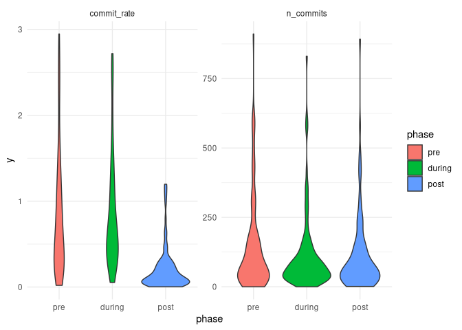

# Effects of rOpenSci review on software development trajectories

``` r
library (ghrecipes)
library (jsonlite)
library (dplyr)
library (lubridate)
library (purrr)
```

## Data Extraction

Use [`ghrecipes`](https://github.com/ropenscilabs/ghrecipes) to get
opening and closing dates of all software review issues:

``` r
x <- get_issue_labels_state ("ropensci", "software-review")
saveRDS (x, file = "review-issues.Rds")
```

Then get the github repo locations and onboarding issue numbers, using
code adapted from my
[`ros-pkg-authors`](https://github.com/mpadge/ros-pkg-authors) repo:

``` r
get_ros_repos <- function () {
    x <- fromJSON (paste0 ("https://raw.githubusercontent.com/ropensci/",
                           "roregistry/gh-pages/registry.json"))
    # reduce to onboarded repos
    index <- grep ("ropensci\\/onboarding\\/issues", x$packages$onboarding)
    x <- x$packages [index, ]

    urls <- gsub ("https://github.com/", "", x$github)
    org <- vapply (urls, function (i) strsplit (i, "/") [[1]] [1],
                    character (1)) %>%
        unname ()
    repo <- vapply (urls, function (i) strsplit (i, "/") [[1]] [2],
                     character (1)) %>%
        unname ()
    s <- "https:\\/\\/github.com\\/ropensci\\/onboarding\\/issues\\/"
    issue <- as.integer (gsub (s, "", x$onboarding))

    tibble::tibble (org = org,
                    repo = repo,
                    onboarding_issue = issue)
}
repos <- get_ros_repos ()
revs <- readRDS ("review-issues.Rds") %>%
    select (number, created_at, closed_at, labels)
repos <- left_join (repos, revs, by = c ("onboarding_issue" = "number"))
```

Download all of the actual repos in order to extract code commits:

``` r
download_repo <- function (repo_dir, org, repo) {
    url <- paste0 ("https://github.com/", org, "/", repo, ".git")
    if (!file.exists (file.path (repo_dir, repo)))
        system2 ("git", args = c ("clone", url))
    else {
        setwd (repo)
        system2 ("git", args = c ("pull", "origin", "master"))
        setwd ("..")
    }
}
download_repos <- function (repo_dir, repos) {
    wd <- setwd (repo_dir)
    x <- apply (repos, 1, function (i) download_repo (repo_dir, i [1], i [2]))
    setwd (wd)
}
x <- download_repos (params$repo_dir, repos)
```

The following functions get dates of all commits from each repo, and
extract mean commit numbers and frequencies during the three phases,
along with change in monthly commit rate following review

``` r
get_commit_dates <- function (repo, repos) {
    wd <- setwd (file.path (params$repo_dir, repo))
    # see git log --help for format options;
    # "ci" is committer date in ISO-like format
    commits <- system2 ("git", c ("log", "--pretty=format:\"%ci\""),
                        stdout = TRUE) %>%
        date () %>%
        rev ()
    # add factors for [before, during, after] review
    rev_dates <- repos [repos$repo == repo, c ("created_at", "closed_at")] %>%
        purrr::map (date)

    commits <- data.frame (date = commits,
                           yymm = paste0 (year (commits),
                                      sprintf ("%02i", month (commits)))) %>%
        mutate (phase = case_when (date < rev_dates$created_at ~ -1,
                                   date < rev_dates$closed_at ~ 0,
                                   TRUE ~ 1))
    setwd (wd)
    return (commits)
}
get_commit_stats <- function (repo, commits) {
    freq <- commits %>%
        group_by (phase) %>%
        summarise (duration = max (date) - min (date),
                   ncommits = length (date)) %>%
        mutate (rate = ncommits / as.numeric (duration))
    # Insert missing phases:
    for (i in -1:1)
        if (!i %in% freq$phase)
            freq <- rbind (tibble ("phase" = i,
                                   "duration" = 0,
                                   "ncommits" = 0,
                                   "rate" = NA),
                           freq)
    # Then get change in commit rate following review
    commits_after <- commits [commits$phase == 1, ] %>%
        group_by (yymm) %>%
        summarise (n = length (yymm)) %>%
        lm (n ~ as.integer (yymm), data = .) %>%
        summary ()
    # explicitly define variables here, to make it clear what is being analysed:
    data.frame ("repo" = repo,
                "n_pre" = freq$ncommits [freq$phase == -1],
                "n_during" = freq$ncommits [freq$phase == 0],
                "n_post" = freq$ncommits [freq$phase == 1],
                "rate_pre" = freq$rate [freq$phase == -1],
                "rate_during" = freq$rate [freq$phase == 0],
                "rate_post" = freq$rate [freq$phase == 1],
                "slope" = commits_after$coefficients [2],
                "p" = commits_after$coefficients [8])
}
```

## Analysis

The main analysis loop is then as simple as,

``` r
local_repos <- list.files (params$repo_dir)
s <- lapply (local_repos, function (i) {
                 commits <- get_commit_dates (i, repos)
                 get_commit_stats (i, commits)
                })
#> Warning in summary.lm(.): essentially perfect fit: summary may be unreliable
s <- do.call (rbind, s)
# post-processing:
s$rate_pre [!is.finite (s$rate_pre)] <- NA
s$rate_during [!is.finite (s$rate_during)] <- NA
s$rate_post [!is.finite (s$rate_post)] <- NA
s$slope [is.nan (s$slope)] <- NA
s$p [is.nan (s$p)] <- NA
```

Summary statistics:

``` r
t.test (s$slope) # commit rates decrease following review
#> 
#>  One Sample t-test
#> 
#> data:  s$slope
#> t = -4.4176, df = 105, p-value = 0.00002434
#> alternative hypothesis: true mean is not equal to 0
#> 95 percent confidence interval:
#>  -0.8576229 -0.3262482
#> sample estimates:
#>  mean of x 
#> -0.5919355

tstats <- function (a, b) {
    res <- t.test (a, b)
    c (res$estimate, "p" = res$p.value)
}
tstats (s$n_pre, s$n_during) # more commits prior to review than during
#>    mean of x    mean of y            p 
#> 163.19819820 109.69369369   0.03089982
tstats (s$n_during, s$n_post) # more commits following review than during
#>   mean of x   mean of y           p 
#> 109.6936937 170.2522523   0.1857788
tstats (s$n_pre, s$n_post) # more commits after than before review
#>  mean of x  mean of y          p 
#> 163.198198 170.252252   0.884446

tstats (s$rate_pre, s$rate_during) # higher rate of commits prior to review than during
#>  mean of x  mean of y          p 
#> 2.33675989 1.16239475 0.02858128
tstats (s$rate_during, s$rate_post) # lower rate of commits following review than before
#>        mean of x        mean of y                p 
#> 1.16239475134180 0.25826767930042 0.00000005020689
tstats (s$rate_pre, s$rate_post) # MUCH lower rate of commits after than before review
#>    mean of x    mean of y            p 
#> 2.3367598947 0.2582676793 0.0000988603
```

Some graphical output:

``` r
library (tidyr)
library (ggplot2)
theme_set (theme_minimal ())
# Note that facetting scales can NOT be set independently; see
# https://github.com/tidyverse/ggplot2/issues/1613
# In lieu of that, values are manually clipped to achieve desired scales
dat_n <- select (s, n_pre, n_during, n_post) %>%
    gather (`n_pre`, `n_during`, `n_post`,
            key = "phase", value = "n_commits") %>%
    filter (n_commits < 1000)
dat_r <- select (s, rate_pre, rate_during, rate_post) %>%
    gather (`rate_pre`, `rate_during`, `rate_post`,
            key = "phase", value = "commit_rate") %>%
    filter (commit_rate < 3)
dat <- bind_rows (data.frame (phase = gsub ("n_", "", dat_n$phase),
                              y = dat_n$n_commits,
                              label = "n_commits",
                              stringsAsFactors = FALSE),
                  data.frame (phase = gsub ("rate_", "", dat_r$phase),
                              y = dat_r$commit_rate,
                              label = "commit_rate",
                              stringsAsFactors = FALSE))
# Convert phase to factor to preserve plot order:
dat$phase <- factor (dat$phase, levels = unique (dat$phase))
ggplot (dat, aes (x = phase, y = y, fill = phase)) +
    geom_violin () +
    facet_wrap (.~label, scales = "free")
```


